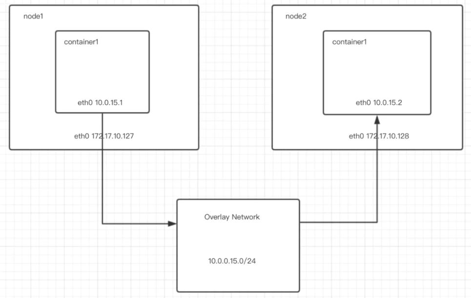

# VE472 Lab 6: Large cluster

## Schedule
Time: `July 7`; `July 14`
- Setup hadoop, spark and drill
- Drill tasks:
  - Which carrier is most commonly late?
  - Which are the three most commonly late origins, due to bad weather?
  - What is the longest delay experienced for each carrier?
- Spark task:
  - Test a statistical model over the **whole** flight data set.

Each group should prepare code for the drill tasks and spark task. A report should be submitted before 23:59, `July 18`.

Everyone in the class is required to come to lab and connect his or her device to the cluster. If anyone fails, deduction might be given to this particular student.

## Setup
### I. Docker
1. Install docker
   ```bash
   # Install dependencies
    apt-get update
    apt-get install -y \
        apt-transport-https \
        ca-certificates \
        curl \
        gpg \
        gnupg \
        lsb-release

    # Install docker
    curl -fsSL https://download.docker.com/linux/debian/gpg | gpg --dearmor -o /usr/share/keyrings/docker-archive-keyring.gpg
    echo \
    "deb [arch=amd64 signed-by=/usr/share/keyrings/docker-archive-keyring.gpg] https://download.docker.com/linux/debian \
    $(lsb_release -cs) stable" | tee /etc/apt/sources.list.d/docker.list > /dev/null
    apt-get update
    apt-get install -y docker-ce docker-ce-cli containerd.io

    # docker-compose
    curl -L "https://github.com/docker/compose/releases/download/1.29.2/docker-compose-$(uname -s)-$(uname -m)" -o /usr/local/bin/docker-compose
    chmod +x /usr/local/bin/docker-compose
    ```
2. Obtain docker image

3. Join network
   
   We can use `docker overlay network` to connect multiple Docker daemon hosts. `docker swarm` is a tool to manage the network.

   

   Links: 
   - https://www.jianshu.com/p/4efdb30f4eaf
   - https://blog.csdn.net/mylitboy/article/details/106369721

4. Start a container
5. Add ssh keys to `authorized_keys`