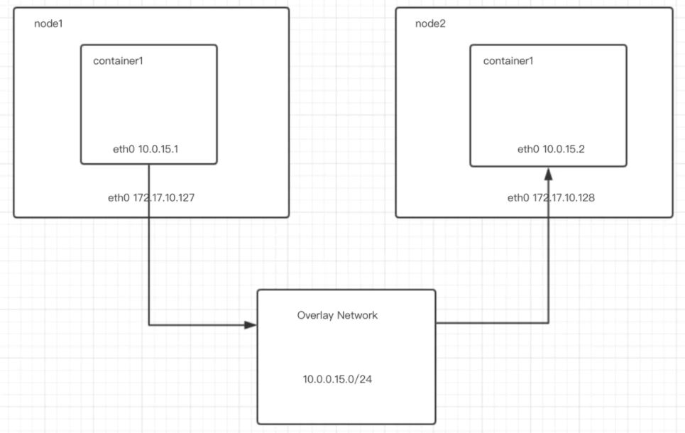

# VE472 Lab 6: Large cluster

## Schedule
Time: `July 7`; `July 14`
- Setup hadoop, spark and drill
- Drill tasks:
  - Which carrier is most commonly late?
  - Which are the three most commonly late origins, due to bad weather?
  - What is the longest delay experienced for each carrier?
- Spark task:
  - Test a statistical model over the **whole** flight data set.

Each group should prepare code for the drill tasks and spark task. A report should be submitted before 23:59, `July 18`.

Everyone in the class is required to come to lab and connect his or her device to the cluster. If anyone fails, deduction might be given to this particular student.

## Setup
### I. Docker
1. Install docker 
   
   ubuntu example: https://docs.docker.com/engine/install/ubuntu/
   
2. Obtain docker image

    ```bash
    sudo docker pull xiejinglei/hadoop-cluster:1.0
    ```

3. Join network
   
   We can use `docker overlay network` to connect multiple Docker daemon hosts. `docker swarm` is a tool to manage the network.

   

   Links: 
   - https://www.jianshu.com/p/4efdb30f4eaf
   - https://blog.csdn.net/mylitboy/article/details/106369721

4. Start a container
5. Add ssh keys to `authorized_keys`

### II. Configure hadoop

### III. Configure spark and drill